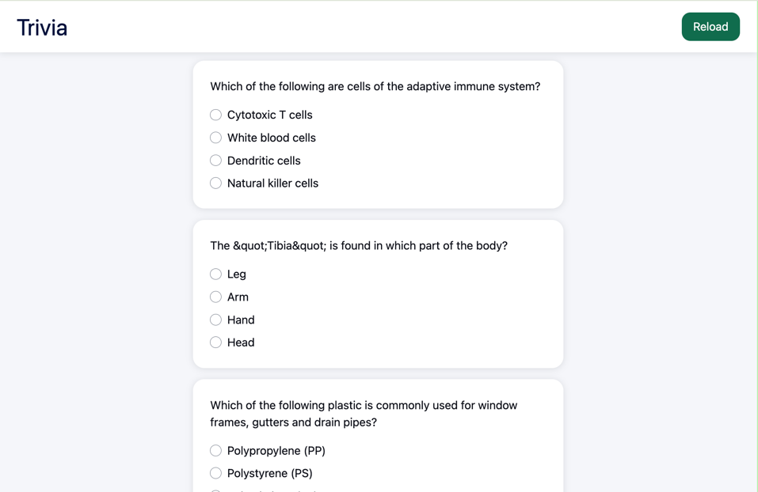
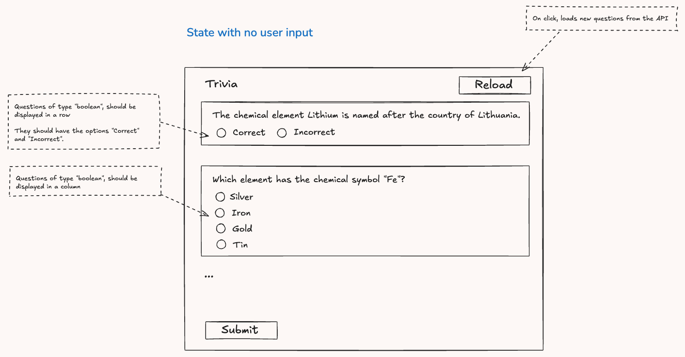
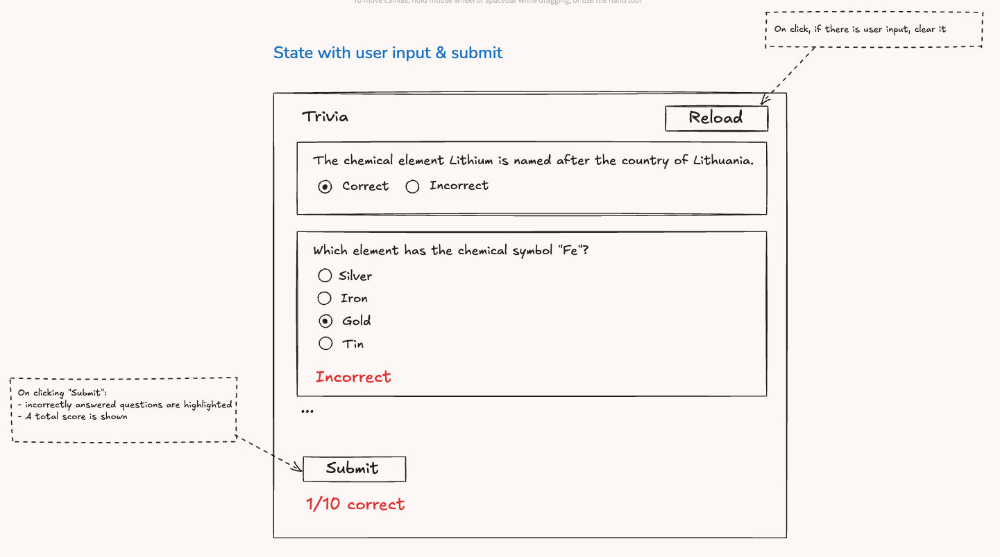

# Trivia App

## Project requirements:
1. Set up a React TypeScript project - you may use Create React App: https://create-react-app.dev/docs/getting-started
2. Use the trivia API: https://opentdb.com/api.php?amount=10&category=17
3. Use a query library, such as TanStack Query to fetch API data: https://tanstack.com/query/latest/docs/framework/react/installation
4. Use the attached wireframes as a reference for how questions should be presented.
5. Styling is optional and may differ entirely from what the wireframe looks like.
6. Optionally, use any additional libraries you prefer.

## Wireframes:

## Implementation notes:
1. When displaying the possible answers for each question of type "multiple", the correct answer is randomly placed among the incorrect answers.
2. For questions of type "boolean", the possible answers are always "Correct" and "Incorrect" in this order.
3. The submit button is disabled until the user selects an answer for all questions.
4. The api has a rate limit of 5 seconds between request (https://opentdb.com/api_config.php), so if the user tries to refetch questions in an interval lower than 5 seconds, a message will be displayed.

## Tech stack

### Frontend stack

- [React](https://reactjs.org/)
- [Tailwind](https://tailwindcss.com/)

### Build & development stack

- [TypeScript](https://www.typescriptlang.org/)
- [ESLint](https://eslint.org/)
- [Prettier](https://prettier.io/)
- [Testing Library](https://testing-library.com/docs/react-testing-library/intro/)

## Setup

### Requirements

1. Install [Node.js](https://nodejs.org/) v16 (or newer)
2. Install [NPM](https://www.npmjs.com/)
3. Install the project dependencies by running `npm install`.

##3 Scripts

These are the main commands you'll need to execute to develop the application.

| Command          | Description                                                       |
| ---------------- | ----------------------------------------------------------------- |
| `npm start`      | Start a new local development server on [http://localhost:3000]() |
| `npm build`      | Build the site for production                                     |
| `npm test`       | Run Jest                                                          |
| `npm run lint`   | Run Eslint                                                        |
| `npm run format` | Run Prettier                                                      |
